# `crates/chicago-tdd-tools/src/testing/state_machine.rs`

Source SHA-256: `091633641fef3683d955e2d3e367de1777437036723a07df0eb6a44a4ccda00f`

```mermaid
classDiagram
    class trait_State {
      <<trait>>
      +"name() -~ &'static str"
    }
    class trait_Transition {
      <<trait>>
      +"execute() -~ Result~(), String~"
    }
    class struct_StateMachine {
      <<struct>>
      +"_state: PhantomData~S~"
    }
    class struct_Actor {
      <<struct>>
      +"id: String"
      +"state_machine: StateMachine~S~"
    }
    class struct_Schedule {
      <<struct>>
      +"steps: Vec~ScheduleStep~"
    }
    class struct_ScheduleStep {
      <<struct>>
      +"actor_id: String"
      +"transition: String"
      +"from_state: String"
      +"to_state: String"
    }
    class struct_ScheduleGenerator {
      <<struct>>
      +"max_depth: usize"
    }
    class struct_ModelChecker {
      <<struct>>
      +"generator: ScheduleGenerator"
    }
    class struct_Locked {
      <<struct>>
    }
    class struct_Unlocked {
      <<struct>>
    }
    class struct_Unlock {
      <<struct>>
    }
    class struct_Lock {
      <<struct>>
    }
    class mod_tests {
      <<mod>>
    }
    note "Actor~S~"
    note "Default for Schedule"
    note "Default for StateMachine~S~"
    note "ModelChecker"
    note "Schedule"
    note "ScheduleGenerator"
    note "State for Locked"
    note "State for Unlocked"
    note "StateMachine~S~"
    note "Transition~Locked"
    note "Transition~Unlocked"
```

## Dependencies

- `std::fmt::Write`
- `std::marker::PhantomData`
- `super::*`

## Standing

- Structural parse: `ALIVE`
- Runtime behavior: `UNKNOWN`
