# `crates/chicago-tdd-tools/src/validation/advanced_phases.rs`

Source SHA-256: `c3755976758de2674a82f8a1857b9851dc5f0e5616f37e358babdda95be4a7b0`

```mermaid
classDiagram
    class struct_ConsensusVote {
      <<struct>>
      +"node_id: String"
      +"receipt_id: String"
      +"approved: bool"
      +"timestamp: u64"
      +"mock_signature: String"
    }
    class struct_DistributedConsensus {
      <<struct>>
      +"node_id: String"
      +"votes: HashMap~String"
      +"threshold: f64"
      +"total_nodes: usize"
    }
    class enum_ConsensusStatus {
      <<enum>>
    }
    class struct_ExecutionSnapshot {
      <<struct>>
      +"id: String"
      +"contract_name: String"
      +"ticks: u64"
      +"state: String"
      +"timestamp: Instant"
    }
    class struct_TimeTravelDebugger {
      <<struct>>
      +"snapshots: Vec~ExecutionSnapshot~"
      +"current_index: usize"
      +"recording: bool"
    }
    class struct_PerformancePrediction {
      <<struct>>
      +"predicted_ticks: u64"
      +"confidence_interval: u64"
      +"confidence: f64"
      +"basis: String"
    }
    class struct_PerformanceProphet {
      <<struct>>
      +"history: Vec~(String"
      +"window_size: usize"
    }
    class struct_QualityMetrics {
      <<struct>>
      +"total_tests: usize"
      +"tests_passed: usize"
      +"tests_failed: usize"
      +"average_tau: f64"
      +"max_tau: u64"
      +"min_tau: u64"
      +"tau_violations: usize"
      +"effect_violations: usize"
      +"coverage_percent: f64"
      +"execution_time: Duration"
    }
    class mod_tests {
      <<mod>>
    }
    note "Default for PerformanceProphet"
    note "Default for TimeTravelDebugger"
    note "DistributedConsensus"
    note "PerformanceProphet"
    note "QualityMetrics"
    note "TimeTravelDebugger"
```

## Dependencies

- `crate::core::receipt::{TestOutcome, TestReceipt}`
- `std::collections::HashMap`
- `std::collections::hash_map::DefaultHasher`
- `std::hash::{Hash, Hasher}`
- `std::time::{Duration, Instant}`
- `super::*`

## Standing

- Structural parse: `ALIVE`
- Runtime behavior: `UNKNOWN`
