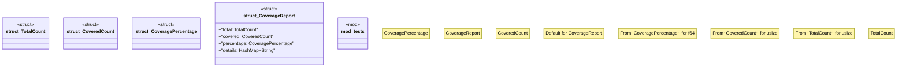

# `crates/chicago-tdd-tools/src/validation/coverage.rs`

Source SHA-256: `79d3fca272779993cbe2c3e8d4da70ad9c58d2b42fa9d6d95bfd31bfed1745ba`

## Dependencies

- `std::collections::HashMap`
- `std::fmt::Write`
- `super::*`

## Standing

- Structural parse: `ALIVE`
- Runtime behavior: `UNKNOWN`
