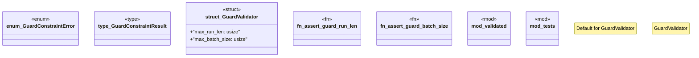

# `crates/chicago-tdd-tools/src/validation/guards/mod.rs`

Source SHA-256: `db4001fd3f3656c4132de0db1060df8765b20497c4bea193acdc805bb2e86149`

## Dependencies

- `super::*`
- `thiserror::Error`
- `validated::{AssertBatchSize, AssertRunLen, ValidatedBatch, ValidatedRun}`

## Standing

- Structural parse: `ALIVE`
- Runtime behavior: `UNKNOWN`
