# `crates/chicago-tdd-tools/src/validation/jtbd.rs`

Source SHA-256: `e9633f1f6d57b46d10fbf7850a6328d011093ef1dc0579f3842eed63196b918a`

```mermaid
classDiagram
    class struct_ScenarioIndex {
      <<struct>>
    }
    class struct_JtbdValidationResult {
      <<struct>>
      +"scenario_name: String"
      +"execution_success: bool"
      +"jtbd_success: bool"
      +"latency_ms: u64"
      +"details: Vec~String~"
      +"expected_behavior: String"
      +"actual_behavior: String"
    }
    class struct_ExecutionContext {
      <<struct>>
      +"variables: HashMap~String"
      +"metadata: HashMap~String"
    }
    class struct_ExecutionResult {
      <<struct>>
      +"success: bool"
      +"variables: HashMap~String"
      +"metadata: HashMap~String"
    }
    class type_ValidateResultFn {
      <<type>>
    }
    class struct_JtbdScenario {
      <<struct>>
      +"name: String"
      +"setup_context: Box~dyn Fn() -~ ExecutionContext + Send + Sync~"
      +"execute: Box~dyn Fn(&ExecutionContext) -~ ExecutionResult + Send + Sync~"
      +"validate_result: ValidateResultFn"
      +"expected_behavior: String"
    }
    class struct_JtbdValidator {
      <<struct>>
      +"scenarios: Vec~JtbdScenario~"
    }
    class struct_JtbdValidationSummary {
      <<struct>>
      +"total_scenarios: usize"
      +"execution_passed: usize"
      +"execution_failed: usize"
      +"jtbd_passed: usize"
      +"jtbd_failed: usize"
      +"avg_latency_ms: u64"
    }
    class mod_tests {
      <<mod>>
    }
    note "Default for JtbdValidator"
    note "ExecutionResult"
    note "From~ScenarioIndex~ for usize"
    note "JtbdValidationResult"
    note "JtbdValidationSummary"
    note "JtbdValidator"
    note "ScenarioIndex"
```

## Dependencies

- `std::collections::HashMap`
- `super::*`

## Standing

- Structural parse: `ALIVE`
- Runtime behavior: `UNKNOWN`
