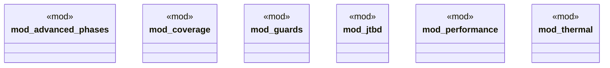

# `crates/chicago-tdd-tools/src/validation/mod.rs`

Source SHA-256: `2b156cd34fb3ba529c678bfb0e0e29f542fb207dfe37ba9c1a5f8c0aa2dffde9`

## Dependencies

- `advanced_phases::*`
- `coverage::*`
- `guards::*`
- `jtbd::*`
- `performance::*`
- `thermal::*`

## Standing

- Structural parse: `ALIVE`
- Runtime behavior: `UNKNOWN`
