# `crates/chicago-tdd-tools/src/validation/performance.rs`

Source SHA-256: `b55bfc4021e7ba089366f1a89a7e830f1fcdd6c0ac4d3e095273f23a16066aaf`

```mermaid
classDiagram
    class enum_PerformanceValidationError {
      <<enum>>
    }
    class type_PerformanceValidationResult {
      <<type>>
    }
    class struct_TickCounter {
      <<struct>>
      +"start_ticks: u64"
    }
    class struct_ValidatedTickBudget {
      <<struct>>
      +"_inner: Validated~u64~"
    }
    class fn_measure_ticks {
      <<fn>>
    }
    class struct_TickMeasurer {
      <<struct>>
      +"f: F"
    }
    class struct_AsyncTickMeasurer {
      <<struct>>
      +"f: F"
    }
    class struct_BenchmarkResult {
      <<struct>>
      +"operation: String"
      +"iterations: u64"
      +"total_ticks: u64"
      +"avg_ticks: f64"
      +"min_ticks: u64"
      +"max_ticks: u64"
      +"p50_ticks: u64"
      +"p95_ticks: u64"
      +"p99_ticks: u64"
    }
    class fn_benchmark {
      <<fn>>
    }
    class struct_Benchmark {
      <<struct>>
    }
    class struct_Benchmark {
      <<struct>>
    }
    class mod_tests {
      <<mod>>
    }
    note "AsyncTickMeasurer~F~"
    note "Benchmark"
    note "BenchmarkResult"
    note "Default for ValidatedTickBudget~BUDGET~"
    note "TickCounter"
    note "TickMeasurer~F~"
    note "ValidatedTickBudget~BUDGET~"
```

## Dependencies

- `crate::core::const_assert::Validated`
- `super::*`
- `thiserror::Error`

## Standing

- Structural parse: `ALIVE`
- Runtime behavior: `UNKNOWN`
