# `crates/chicago-tdd-tools/src/validation/thermal.rs`

Source SHA-256: `37647f540ef5b483bf0b7a09a2f542929e3f46b7b970a03707f14255fc605114`

```mermaid
classDiagram
    class enum_ThermalTestError {
      <<enum>>
    }
    class type_ThermalTestResult {
      <<type>>
    }
    class struct_HotPathConfig {
      <<struct>>
      +"max_ticks: u64"
      +"enforce_no_alloc: bool"
      +"enforce_no_syscall: bool"
    }
    class struct_WarmPathConfig {
      <<struct>>
      +"max_ticks: u64"
      +"max_memory_bytes: usize"
      +"enforce_no_network: bool"
      +"enforce_no_storage: bool"
    }
    class struct_ColdPathConfig {
      <<struct>>
      +"timeout_ms: u64"
    }
    class struct_HotPathTest {
      <<struct>>
      +"config: HotPathConfig"
    }
    class struct_WarmPathTest {
      <<struct>>
      +"config: WarmPathConfig"
    }
    class struct_ColdPathTest {
      <<struct>>
      +"config: ColdPathConfig"
    }
    class mod_tests {
      <<mod>>
    }
    note "ColdPathConfig"
    note "ColdPathTest"
    note "Default for ColdPathConfig"
    note "Default for ColdPathTest"
    note "Default for HotPathConfig"
    note "Default for HotPathTest"
    note "Default for WarmPathConfig"
    note "Default for WarmPathTest"
    note "HotPathConfig"
    note "HotPathTest"
    note "WarmPathConfig"
    note "WarmPathTest"
```

## Dependencies

- `crate::validation::performance::{TickCounter, HOT_PATH_TICK_BUDGET}`
- `super::*`
- `thiserror::Error`

## Standing

- Structural parse: `ALIVE`
- Runtime behavior: `UNKNOWN`
