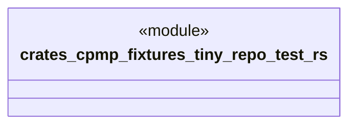

# `crates/cpmp/fixtures/tiny-repo/test.rs`

Source SHA-256: `e3b0c44298fc1c149afbf4c8996fb92427ae41e4649b934ca495991b7852b855`

## Dependencies

- None observed.

## Standing

- Structural parse: `ALIVE`
- Runtime behavior: `UNKNOWN`
