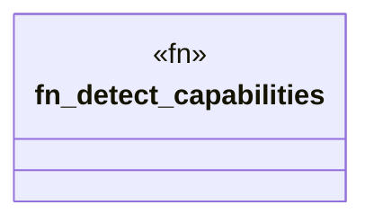

# `crates/cpmp/src/capability.rs`

Source SHA-256: `b24f886a836683645c1df453fcf8e73d27afbb4e85c01fc7959d6b8bcbf61332`

## Dependencies

- `crate::models::{DetectedCapability, Symbol}`
- `std::path::Path`

## Standing

- Structural parse: `ALIVE`
- Runtime behavior: `UNKNOWN`
