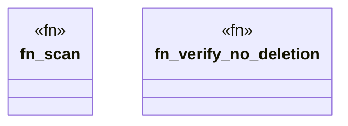

# `crates/cpmp/src/catalog.rs`

Source SHA-256: `ebe9f02036fe1f4fe070aed41452408f005e635bcd8da5b40e056732ef28ecaf`

## Dependencies

- `clap_noun_verb::{NounVerbError, Result}`
- `clap_noun_verb_macros::verb`
- `serde_json::{json, Value}`
- `std::path::PathBuf`

## Standing

- Structural parse: `ALIVE`
- Runtime behavior: `UNKNOWN`
