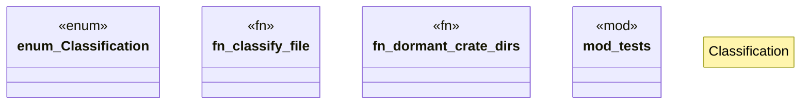

# `crates/cpmp/src/classification.rs`

Source SHA-256: `e4164dd3fb57f6f059133e11db7b4785c41632ecfda6062ad9c046596111548b`

## Dependencies

- `crate::models::Symbol`
- `super::*`

## Standing

- Structural parse: `ALIVE`
- Runtime behavior: `UNKNOWN`
