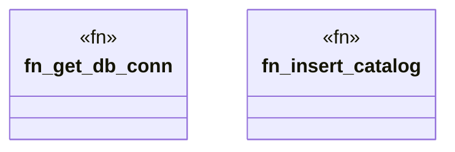

# `crates/cpmp/src/db.rs`

Source SHA-256: `d9d94218c51289ae1d2568433e77189a519ffd4543fae053aff171ed4eabf957`

## Dependencies

- `crate::models::{DetectedCapability, FileEntry, Symbol}`
- `rusqlite::{Connection, Result}`
- `std::path::Path`

## Standing

- Structural parse: `ALIVE`
- Runtime behavior: `UNKNOWN`
