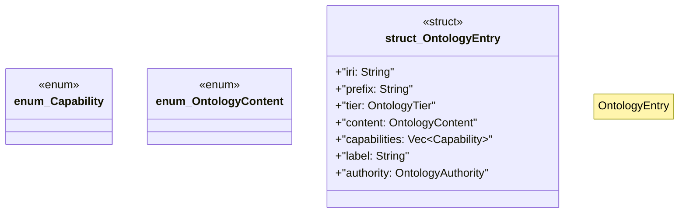

# `crates/cpmp/src/entry.rs`

Source SHA-256: `1b4a3851125208e0b13f255d66a42660448526018e8b8d786d9d4cd96cc79fdd`

## Dependencies

- `crate::tier::{OntologyAuthority, OntologyTier}`

## Standing

- Structural parse: `ALIVE`
- Runtime behavior: `UNKNOWN`
