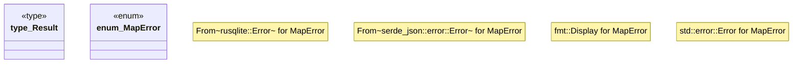

# `crates/cpmp/src/error.rs`

Source SHA-256: `28ad3f2c691dbdf244a1b7d07c795862867c67c6a3f551b39d37ab1349bbb6e1`

## Dependencies

- `std::fmt`
- `std::io`

## Standing

- Structural parse: `ALIVE`
- Runtime behavior: `UNKNOWN`
