# `crates/cpmp/src/lib.rs`

Source SHA-256: `561890baa2aa61c409f43f2d14703b1aac61923e552ab045bc053a3b2492674c`

```mermaid
classDiagram
    class mod_capability {
      <<mod>>
    }
    class mod_catalog {
      <<mod>>
    }
    class mod_classification {
      <<mod>>
    }
    class mod_db {
      <<mod>>
    }
    class mod_entry {
      <<mod>>
    }
    class mod_models {
      <<mod>>
    }
    class mod_ocel {
      <<mod>>
    }
    class mod_projection {
      <<mod>>
    }
    class mod_receipt {
      <<mod>>
    }
    class mod_registry {
      <<mod>>
    }
    class mod_scanner {
      <<mod>>
    }
    class mod_symbol {
      <<mod>>
    }
    class mod_tier {
      <<mod>>
    }
    class fn_run_cli {
      <<fn>>
    }
```

## Dependencies

- None observed.

## Standing

- Structural parse: `ALIVE`
- Runtime behavior: `UNKNOWN`
