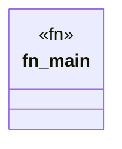

# `crates/cpmp/src/main.rs`

Source SHA-256: `1261c9c999ce6e5e8120261e2adecf8c58b689140c7569ca896c5bafa63678aa`

## Dependencies

- None observed.

## Standing

- Structural parse: `ALIVE`
- Runtime behavior: `UNKNOWN`
