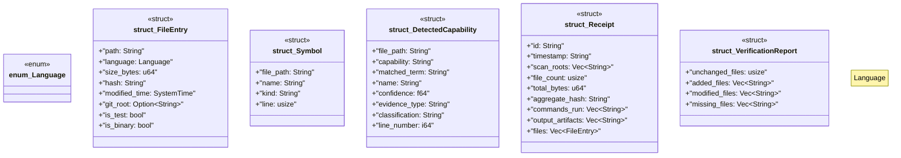

# `crates/cpmp/src/models.rs`

Source SHA-256: `e653463ae7085b02c21df58ae267398820666bcb946a1786690f0ea37b5b16d1`

## Dependencies

- `serde::{Deserialize, Serialize}`
- `std::time::SystemTime`

## Standing

- Structural parse: `ALIVE`
- Runtime behavior: `UNKNOWN`
