# `crates/cpmp/src/ocel.rs`

Source SHA-256: `ca8fec74284c5c7f49ed9cdd15791f20d93756d6abf7b115673b94e9438276c7`

```mermaid
classDiagram
    class enum_OcelError {
      <<enum>>
    }
    class type_OcelResult {
      <<type>>
    }
    class struct_OcelAttribute {
      <<struct>>
      +"key: String"
      +"value: serde_json::Value"
      +"time: Option~DateTime~Utc~~"
    }
    class struct_OcelRelationship {
      <<struct>>
      +"object_id: String"
      +"qualifier: String"
    }
    class struct_OcelEvent {
      <<struct>>
      +"id: String"
      +"activity: String"
      +"timestamp: DateTime~Utc~"
      +"relationships: Vec~OcelRelationship~"
      +"attributes: Vec~OcelAttribute~"
    }
    class struct_OcelO2ORelationship {
      <<struct>>
      +"source_object_id: String"
      +"target_object_id: String"
      +"qualifier: String"
    }
    class struct_OcelObject {
      <<struct>>
      +"id: String"
      +"object_type: String"
      +"attributes: Vec~OcelAttribute~"
      +"relationships: Vec~OcelO2ORelationship~"
    }
    class struct_OcelAttributeSpec {
      <<struct>>
      +"name: String"
      +"attr_type: String"
    }
    class struct_OcelObjectTypeSpec {
      <<struct>>
      +"name: String"
      +"attributes: Vec~OcelAttributeSpec~"
    }
    class struct_OcelEventTypeSpec {
      <<struct>>
      +"name: String"
      +"attributes: Vec~OcelAttributeSpec~"
    }
    class struct_OcelEventLog {
      <<struct>>
      +"object_types: Vec~OcelObjectTypeSpec~"
      +"event_types: Vec~OcelEventTypeSpec~"
      +"objects: Vec~OcelObject~"
      +"events: Vec~OcelEvent~"
    }
    class struct_OcelReader {
      <<struct>>
    }
    class struct_EventLogStats {
      <<struct>>
      +"event_count: usize"
      +"object_count: usize"
      +"activity_type_count: usize"
      +"object_type_count: usize"
      +"dfg_edge_count: usize"
      +"variant_count: usize"
    }
    note "OcelEvent"
    note "OcelEventLog"
    note "OcelReader"
```

## Dependencies

- `chrono::{DateTime, Utc}`
- `serde::{Deserialize, Serialize}`
- `std::collections::HashMap`

## Standing

- Structural parse: `ALIVE`
- Runtime behavior: `UNKNOWN`
