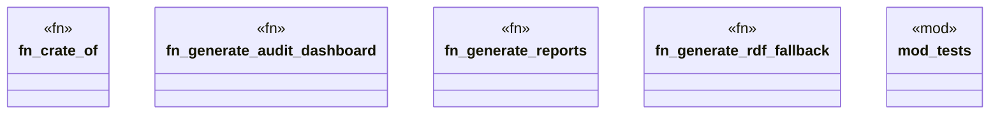

# `crates/cpmp/src/projection.rs`

Source SHA-256: `26ec692a11dd491136c100742cb1fcef10647c20dcbe196d15ced6344c7860f7`

## Dependencies

- `anyhow::Result`
- `crate::models::Language`
- `crate::models::{DetectedCapability, FileEntry, Receipt}`
- `std::collections::BTreeMap`
- `std::collections::{BTreeMap, BTreeSet}`
- `std::time::SystemTime`
- `super::*`

## Standing

- Structural parse: `ALIVE`
- Runtime behavior: `UNKNOWN`
