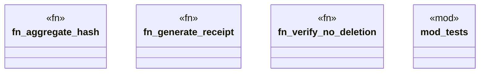

# `crates/cpmp/src/receipt.rs`

Source SHA-256: `35be7cb44d06d9bc0c7041c9b10e31d0ff7d30a9bb8fe7fd792bc4a15d9b27ac`

## Dependencies

- `anyhow::Result`
- `crate::models::{FileEntry, Language}`
- `crate::models::{FileEntry, Receipt}`
- `std::path::PathBuf`
- `std::time::SystemTime`
- `super::*`
- `uuid::Uuid`

## Standing

- Structural parse: `ALIVE`
- Runtime behavior: `UNKNOWN`
