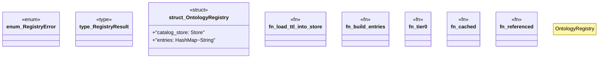

# `crates/cpmp/src/registry.rs`

Source SHA-256: `ee768d7f8aabf38181c4229ccfe61d73487955fd05de204b343f43bed040b4c8`

## Dependencies

- `crate::entry::{Capability, OntologyContent, OntologyEntry}`
- `crate::tier::{OntologyAuthority, OntologyTier}`
- `oxigraph::io::{RdfFormat, RdfParser}`
- `oxigraph::store::Store`
- `std::collections::HashMap`
- `std::sync::OnceLock`

## Standing

- Structural parse: `ALIVE`
- Runtime behavior: `UNKNOWN`
