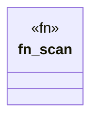

# `crates/cpmp/src/scanner.rs`

Source SHA-256: `e57f1464b6d5d9a01abb61d7a285c719d49527f1e7294a8c38581e88d0846fe6`

## Dependencies

- `anyhow::Result`
- `crate::capability`
- `crate::models::{FileEntry, Symbol}`
- `crate::symbol`
- `std::path::PathBuf`
- `walkdir::WalkDir`

## Standing

- Structural parse: `ALIVE`
- Runtime behavior: `UNKNOWN`
