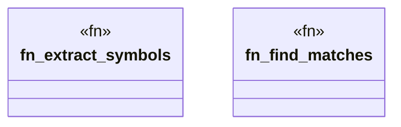

# `crates/cpmp/src/symbol.rs`

Source SHA-256: `d664845edb58b61085b5f55f7f156a0cd40fca76fd510c1ac73fc0d901cc7cc3`

## Dependencies

- `crate::models::Symbol`
- `regex::Regex`
- `std::path::Path`

## Standing

- Structural parse: `ALIVE`
- Runtime behavior: `UNKNOWN`
