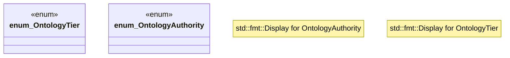

# `crates/cpmp/src/tier.rs`

Source SHA-256: `eb02f88c3f14d45138503920ee0ed27a843a3c81203f3574fdd191b3e9f08205`

## Dependencies

- None observed.

## Standing

- Structural parse: `ALIVE`
- Runtime behavior: `UNKNOWN`
