# `crates/cpmp/tests/registry_test.rs`

Source SHA-256: `c57d87da07b1095282b20e7cdb0b69c6e11f8b2693c7b0f70c49325ef7f72713`

```mermaid
classDiagram
    class fn_global_singleton_initialises_without_panic {
      <<fn>>
    }
    class fn_tier0_returns_exactly_eight_iris {
      <<fn>>
    }
    class fn_tier0_iris_include_all_w3c_foundations {
      <<fn>>
    }
    class fn_catalog_store_contains_triples_after_load {
      <<fn>>
    }
    class fn_tier0_entries_have_embedded_content {
      <<fn>>
    }
    class fn_load_tier0_into_store_populates_owl_classes {
      <<fn>>
    }
    class fn_catalog_covers_all_three_tiers {
      <<fn>>
    }
    class fn_total_catalog_entry_count_meets_vision_2030_minimum {
      <<fn>>
    }
    class fn_get_entry_by_iri_returns_correct_tier {
      <<fn>>
    }
```

## Dependencies

- `cpmp::registry::OntologyRegistry`
- `cpmp::tier::OntologyTier`
- `oxigraph::store::Store`

## Standing

- Structural parse: `ALIVE`
- Runtime behavior: `UNKNOWN`
