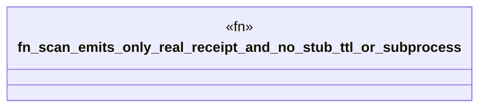

# `crates/cpmp/tests/scan_honesty_test.rs`

Source SHA-256: `e613b1a3186037f0647e6bc3dae4dcdda4cd20b89ee845faf60e7e373d79574e`

## Dependencies

- `cpmp::models::Receipt`
- `cpmp::scanner::scan`
- `std::path::PathBuf`

## Standing

- Structural parse: `ALIVE`
- Runtime behavior: `UNKNOWN`
