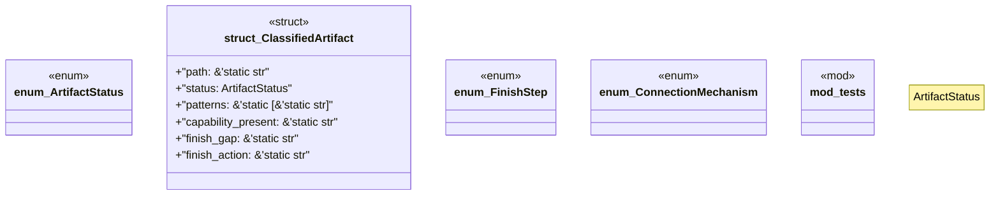

# `crates/genesis-core-v2/src/inventory.rs`

Source SHA-256: `69d31bccdd0fa1b716a287319d2be590ce3cca1e6d7e7c3f41ef2e1ff421380b`

## Dependencies

- `super::*`

## Standing

- Structural parse: `ALIVE`
- Runtime behavior: `UNKNOWN`
