# `crates/genesis-core-v2/src/primitives.rs`

Source SHA-256: `2dc51d6a528a4007e26e9572d56000465c188dded47986da0765320be3348a3c`

```mermaid
classDiagram
    class struct_Pair2 {
      <<struct>>
      +"left: u8"
      +"right: u8"
    }
    class enum_RefusalReason {
      <<enum>>
    }
    class struct_Refusal {
      <<struct>>
      +"epoch: u64"
      +"reason: RefusalReason"
      +"failed_pair: Pair2"
    }
    class struct_RelationPage {
      <<struct>>
      +"predicate: u32"
      +"len: u32"
      +"pairs: [Pair2; CAP]"
    }
    class struct_Construct8 {
      <<struct>>
      +"epoch: u64"
      +"relation_id: u32"
      +"lanes: [Pair2; 8]"
      +"valid_mask: u8"
    }
    class struct_Receipt {
      <<struct>>
      +"signature: [u8; 32]"
    }
    class struct_ReplayCursor {
      <<struct>>
      +"expected_epoch: u64"
      +"expected_relation_id: u32"
      +"processed_count: u64"
      +"last_receipt: [u8; 32]"
    }
    class mod_tests {
      <<mod>>
    }
    note "Construct8"
    note "Pair2"
    note "Receipt"
    note "Refusal"
    note "RelationPage~CAP~"
    note "ReplayCursor"
```

## Dependencies

- `super::*`

## Standing

- Structural parse: `ALIVE`
- Runtime behavior: `UNKNOWN`
