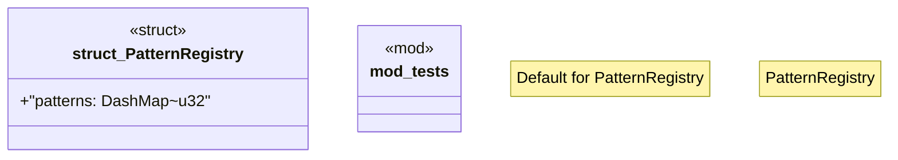

# `crates/genesis-core-v2/src/registry.rs`

Source SHA-256: `38de49a86989e7f83f69f6148a9a0366397a1f3bf71d0ad2736c1b73c2ca356e`

## Dependencies

- `crate::Pattern`
- `dashmap::DashMap`
- `std::sync::Arc`
- `super::*`

## Standing

- Structural parse: `ALIVE`
- Runtime behavior: `UNKNOWN`
