# `crates/genesis-core-v2/src/revelation.rs`

Source SHA-256: `4aff83bd3b32d4f8027130ce3f6b7fcf99c8122d518fabddd77770055ae8ce9f`

```mermaid
classDiagram
    class enum_Church {
      <<enum>>
    }
    class enum_ChurchVerdict {
      <<enum>>
    }
    class struct_ChurchJudgment {
      <<struct>>
      +"church: Church"
      +"verdict: ChurchVerdict"
      +"epoch: u64"
      +"evidence_receipt: [u8; 32]"
    }
    class enum_Seal {
      <<enum>>
    }
    class struct_SealState {
      <<struct>>
      +"seal: Seal"
      +"broken: bool"
      +"breaking_receipt: [u8; 32]"
    }
    class enum_Plague {
      <<enum>>
    }
    class struct_PlagueRecord {
      <<struct>>
      +"plague: Plague"
      +"epoch: u64"
      +"trigger: Pair2"
      +"exposure_receipt: [u8; 32]"
    }
    class enum_BabylonClaim {
      <<enum>>
    }
    class fn_verify_lamb_authority {
      <<fn>>
    }
    class struct_JerusalemGate {
      <<struct>>
      +"foundation: Seal"
      +"passable: bool"
      +"gate_receipt: [u8; 32]"
    }
    class fn_passes_all_gates {
      <<fn>>
    }
    class mod_tests {
      <<mod>>
    }
    note "ChurchJudgment"
    note "JerusalemGate"
    note "Plague"
    note "PlagueRecord"
    note "SealState"
```

## Dependencies

- `crate::primitives::Construct8`
- `crate::primitives::{Construct8, Pair2, Receipt, Refusal, RefusalReason}`
- `crate::primitives::{Pair2, Receipt, Refusal, RefusalReason}`
- `super::*`

## Standing

- Structural parse: `ALIVE`
- Runtime behavior: `UNKNOWN`
