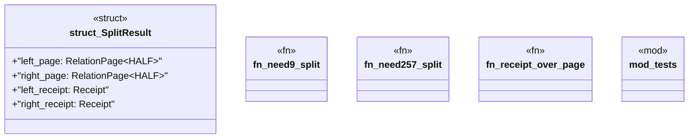

# `crates/genesis-core-v2/src/split_laws.rs`

Source SHA-256: `c4801814c870a2ee178f3749e99a1faedb2b4029ad266d63ae29b414e89f67a1`

## Dependencies

- `crate::primitives::{Construct8, Pair2, Receipt, Refusal, RefusalReason, RelationPage}`
- `crate::primitives::{Pair2, RefusalReason, RelationPage}`
- `super::*`

## Standing

- Structural parse: `ALIVE`
- Runtime behavior: `UNKNOWN`
