# `crates/genesis-core-v2/tests/receipt_chain_test.rs`

Source SHA-256: `3aa1bf9115b6228f164f328e5eeff7dc97f9f9b1366a469f471a20144fba83f3`

```mermaid
classDiagram
    class fn_build_chain {
      <<fn>>
    }
    class fn_test_receipt_chain_all_non_zero {
      <<fn>>
    }
    class fn_test_receipt_chain_all_distinct {
      <<fn>>
    }
    class fn_test_replay_cursor_validates_full_chain {
      <<fn>>
    }
    class fn_test_tampered_receipt_causes_mismatch_refusal {
      <<fn>>
    }
    class fn_test_out_of_order_epoch_refusal {
      <<fn>>
    }
    class fn_test_forged_all_zero_receipt_fails {
      <<fn>>
    }
    class fn_test_receipt_input_sensitivity {
      <<fn>>
    }
    class fn_test_previous_receipt_sensitivity {
      <<fn>>
    }
```

## Dependencies

- `genesis_core_v2::primitives::{ Construct8, Pair2, Receipt, Refusal, RefusalReason, ReplayCursor, }`

## Standing

- Structural parse: `ALIVE`
- Runtime behavior: `UNKNOWN`
