# `crates/genesis-core-v2/tests/receipt_chain_verification_test.rs`

Source SHA-256: `80bf4bae2165b2aa50bf56fd40ac80c509611bb5343ba41ca4289437ad0b07ce`

```mermaid
classDiagram
    class struct_TruexReceiptFixture {
      <<struct>>
      +"temp_dir: TempDir"
      +"truex_receipts_dir: PathBuf"
      +"mcpp_receipts_dir: PathBuf"
      +"ggen_receipts_dir: PathBuf"
    }
    class struct_ReceiptEnvelope {
      <<struct>>
      +"version: String"
      +"schema: String"
      +"producer: Producer"
      +"payload: ReceiptPayload"
      +"previous: Option~String~"
      +"signature: Signature"
      +"timestamp: String"
    }
    class struct_Producer {
      <<struct>>
      +"system: String"
      +"kind: String"
    }
    class struct_ReceiptPayload {
      <<struct>>
      +"schema: String"
      +"hash: String"
      +"path: String"
      +"input_hashes: HashMap~String"
      +"output_hashes: HashMap~String"
    }
    class struct_Signature {
      <<struct>>
      +"algorithm: String"
      +"key_id: String"
      +"bytes: String"
    }
    class fn_test_truex_load_receipt_chain {
      <<fn>>
    }
    class fn_test_causal_chain_ggen_to_mcpp {
      <<fn>>
    }
    class fn_test_receipt_signature_verification {
      <<fn>>
    }
    class fn_test_blake3_determinism_validation {
      <<fn>>
    }
    class fn_test_full_receipt_chain_validation {
      <<fn>>
    }
    class fn_test_powl_conformance_via_receipt_replay {
      <<fn>>
    }
    note "ReceiptEnvelope"
    note "TruexReceiptFixture"
```

## Dependencies

- `std::collections::HashMap`
- `std::fs`
- `std::path::{Path, PathBuf}`
- `tempfile::TempDir`

## Standing

- Structural parse: `ALIVE`
- Runtime behavior: `UNKNOWN`
