# `crates/genesis-types-v2/src/lib.rs`

Source SHA-256: `733c03742317cd00d1035bda077000bcf90b5cf4b5eecf0441febebdd3ad3df5`

```mermaid
classDiagram
    class mod_schema {
      <<mod>>
    }
    class struct_PatternId {
      <<struct>>
    }
    class struct_StepId {
      <<struct>>
    }
    class struct_ExecutionId {
      <<struct>>
    }
    class struct_WorkflowDef {
      <<struct>>
      +"id: String"
      +"name: String"
      +"version: String"
      +"patterns: Vec~PatternDef~"
      +"steps: Vec~WorkflowStep~"
    }
    class struct_PatternDef {
      <<struct>>
      +"id: PatternId"
      +"name: String"
      +"category: String"
      +"inputs: Vec~String~"
      +"outputs: Vec~String~"
    }
    class struct_WorkflowStep {
      <<struct>>
      +"id: StepId"
      +"pattern_id: PatternId"
      +"inputs: HashMap~String"
      +"outputs: Vec~String~"
    }
    class enum_ExecutionState {
      <<enum>>
    }
    class struct_ExecutionContext {
      <<struct>>
      +"id: ExecutionId"
      +"workflow_id: String"
      +"state: ExecutionState"
      +"current_step: Option~StepId~"
      +"data: HashMap~String"
    }
    class struct_Event {
      <<struct>>
      +"id: String"
      +"execution_id: ExecutionId"
      +"step_id: Option~StepId~"
      +"event_type: String"
      +"data: serde_json::Value"
      +"timestamp: chrono::DateTime~chrono::Utc~"
    }
    class enum_Error {
      <<enum>>
    }
    class type_Result {
      <<type>>
    }
    class struct_PowlNode {
      <<struct>>
      +"id: String"
      +"activity: String"
      +"object_refs: Vec~String~"
      +"guard: Option~String~"
    }
    class struct_PowlEdge {
      <<struct>>
      +"from: String"
      +"to: String"
      +"condition: Option~String~"
    }
    class struct_PowlGraph {
      <<struct>>
      +"id: String"
      +"name: String"
      +"nodes: Vec~PowlNode~"
      +"edges: Vec~PowlEdge~"
      +"root: String"
      +"sinks: Vec~String~"
    }
    class enum_AdmissionStatus {
      <<enum>>
    }
    class struct_GateResult {
      <<struct>>
      +"gate_id: String"
      +"gate_name: String"
      +"status: AdmissionStatus"
      +"detail: String"
      +"evidence_hash: Option~String~"
    }
    class struct_ProcessAdmissionReport {
      <<struct>>
      +"operation_id: String"
      +"graph_id: String"
      +"status: AdmissionStatus"
      +"gates: Vec~GateResult~"
      +"receipt_hash: Option~String~"
      +"timestamp: chrono::DateTime~chrono::Utc~"
    }
    class mod_tests {
      <<mod>>
    }
    class enum_EvidenceTier {
      <<enum>>
    }
    class struct_RepairBand {
      <<struct>>
      +"default_band: (f64"
      +"preferred_band: (f64"
      +"forbidden_band: (f64"
      +"tier: EvidenceTier"
      +"unit: String"
    }
    class struct_ResidualDimension {
      <<struct>>
      +"name: String"
      +"measured: f64"
      +"target: (f64"
      +"residual: f64"
    }
    class struct_ResidualVector {
      <<struct>>
      +"dimensions: Vec~ResidualDimension~"
      +"dominant: Option~String~"
    }
    class struct_BoundedRepairOperator {
      <<struct>>
      +"id: String"
      +"targets_dimension: String"
      +"band: RepairBand"
      +"description: String"
      +"modifies_source_law: bool"
    }
    class struct_VisualGapReport {
      <<struct>>
      +"render_hash: String"
      +"timestamp: chrono::DateTime~chrono::Utc~"
      +"residuals: ResidualVector"
      +"is_fresh_render: bool"
    }
    class struct_RepairAdmissionReport {
      <<struct>>
      +"operator_id: String"
      +"before: ResidualVector"
      +"after: ResidualVector"
      +"admitted: bool"
      +"detail: String"
    }
    class mod_residual_vector_tests {
      <<mod>>
    }
    note "AdmissionStatus"
    note "Event"
    note "ExecutionContext"
    note "ExecutionId"
    note "PatternId"
    note "PowlGraph"
    note "ProcessAdmissionReport"
    note "RepairAdmissionReport"
    note "RepairBand"
    note "ResidualDimension"
    note "ResidualVector"
    note "StepId"
    note "VisualGapReport"
```

## Dependencies

- `serde::{Deserialize, Serialize}`
- `std::collections::HashMap`
- `super::*`
- `uuid::Uuid`

## Standing

- Structural parse: `ALIVE`
- Runtime behavior: `UNKNOWN`
