# `crates/genesis-types-v2/src/schema.rs`

Source SHA-256: `d99ed818608dac4477a45f37f66a4a0399e1df3be8d313b3db86c9586d290caa`

```mermaid
classDiagram
    class struct_OpenApiSpec {
      <<struct>>
      +"openapi: String"
      +"info: ApiInfo"
      +"paths: HashMap~String"
      +"components: Components"
    }
    class struct_ApiInfo {
      <<struct>>
      +"title: String"
      +"version: String"
      +"description: Option~String~"
    }
    class struct_PathItem {
      <<struct>>
      +"post: Option~Operation~"
      +"get: Option~Operation~"
      +"put: Option~Operation~"
      +"delete: Option~Operation~"
    }
    class struct_Operation {
      <<struct>>
      +"summary: String"
      +"operation_id: String"
      +"parameters: Vec~Parameter~"
      +"request_body: Option~RequestBody~"
      +"responses: HashMap~String"
    }
    class struct_Parameter {
      <<struct>>
      +"name: String"
      +"in_: String"
      +"required: bool"
      +"schema: SchemaRef"
    }
    class struct_RequestBody {
      <<struct>>
      +"required: bool"
      +"content: HashMap~String"
    }
    class struct_MediaType {
      <<struct>>
      +"schema: SchemaRef"
    }
    class struct_Response {
      <<struct>>
      +"description: String"
      +"content: Option~HashMap~String"
    }
    class enum_SchemaRef {
      <<enum>>
    }
    class struct_JsonSchema {
      <<struct>>
      +"schema_type: String"
      +"properties: Option~HashMap~String"
      +"required: Option~Vec~String~~"
    }
    class struct_Components {
      <<struct>>
      +"schemas: HashMap~String"
    }
    class struct_RdfOntology {
      <<struct>>
      +"namespace: String"
      +"triples: Vec~(String"
    }
    class struct_PatternMetadata {
      <<struct>>
      +"id: u32"
      +"name: String"
      +"category: String"
      +"description: String"
      +"yawl_pattern_id: String"
      +"is_control_flow: bool"
    }
    class struct_PatternRegistry {
      <<struct>>
      +"patterns: HashMap~u32"
    }
    class mod_tests {
      <<mod>>
    }
    note "Default for PatternRegistry"
    note "OpenApiSpec"
    note "PatternRegistry"
    note "RdfOntology"
```

## Dependencies

- `serde::{Deserialize, Serialize}`
- `std::collections::HashMap`
- `super::*`

## Standing

- Structural parse: `ALIVE`
- Runtime behavior: `UNKNOWN`
