# `crates/genesis-types-v2/tests/post_chatman_powl_integration.rs`

Source SHA-256: `5f1324ab69860d2c62ac701819d7f7fb266b142e23a561c942d1d84be9fc89fc`

```mermaid
classDiagram
    class fn_test_vision_snap_loop_admission_full_flow {
      <<fn>>
    }
    class fn_test_partial_alive_propagates_when_one_gate_partial {
      <<fn>>
    }
    class fn_test_refused_gate_dominates_alive_gates {
      <<fn>>
    }
    class fn_test_powl_graph_with_loop_is_structurally_valid {
      <<fn>>
    }
    class fn_test_process_admission_report_roundtrip_json {
      <<fn>>
    }
    class fn_test_powl_graph_full_pipeline_duplicate_node_is_violation {
      <<fn>>
    }
    class fn_test_unknown_gate_without_refused_produces_unknown_status {
      <<fn>>
    }
```

## Dependencies

- `genesis_types::{ AdmissionStatus, GateResult, PowlEdge, PowlGraph, PowlNode, ProcessAdmissionReport, }`

## Standing

- Structural parse: `ALIVE`
- Runtime behavior: `UNKNOWN`
