# `crates/genesis-types-v2/tests/post_chatman_residual_integration.rs`

Source SHA-256: `4bc4fc3de2e3449d61c65bf788d1eba9830dad6e0883f37c95fae30cfec7d4c7`

```mermaid
classDiagram
    class fn_test_residual_vector_repair_admission_flow {
      <<fn>>
    }
    class fn_test_repair_no_improvement_is_not_admitted {
      <<fn>>
    }
    class fn_test_repair_reduces_failing_count_is_admitted {
      <<fn>>
    }
    class fn_test_repair_band_enforcement {
      <<fn>>
    }
    class fn_test_stale_visual_gap_report_is_rejected {
      <<fn>>
    }
    class fn_test_fresh_visual_gap_report_is_accepted {
      <<fn>>
    }
    class fn_test_dominant_dimension_is_largest_absolute_residual {
      <<fn>>
    }
    class fn_test_empty_residual_vector_has_no_dominant_and_all_passing {
      <<fn>>
    }
    class fn_test_bounded_repair_operator_serializes_and_has_correct_fields {
      <<fn>>
    }
    class fn_test_evidence_tier_all_variants_roundtrip {
      <<fn>>
    }
    class fn_test_repair_admission_detail_message_reflects_failure_reduction {
      <<fn>>
    }
```

## Dependencies

- `genesis_types::{ BoundedRepairOperator, EvidenceTier, RepairAdmissionReport, RepairBand, ResidualDimension, ResidualVector, VisualGapReport, }`

## Standing

- Structural parse: `ALIVE`
- Runtime behavior: `UNKNOWN`
