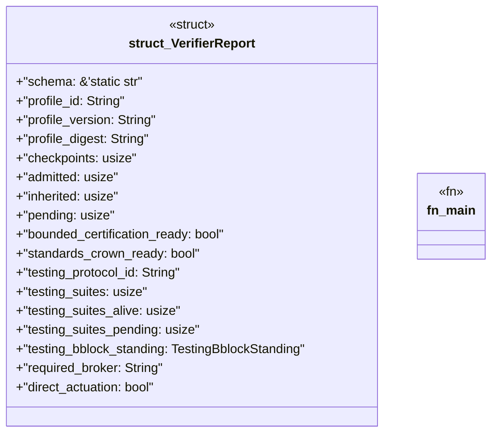

# `crates/ggen-architecture/examples/seven_day_standards_report.rs`

Source SHA-256: `060c1328618a06cb3053b35b3e3e4ede3d3ff3a52e70c72d1a27b1ec60952ee5`

## Dependencies

- `ggen_architecture::{seven_day_standards_profile, StandardStatus, TestingBblockStanding}`
- `serde::Serialize`

## Standing

- Structural parse: `ALIVE`
- Runtime behavior: `UNKNOWN`
