# `crates/ggen-architecture/src/building_block.rs`

Source SHA-256: `0aa7de0ba96bbedf356a4e3424592414bff36f157a3e6e1bba3e3340e8cc9299`

```mermaid
classDiagram
    class enum_LifecycleState {
      <<enum>>
    }
    class enum_Standing {
      <<enum>>
    }
    class enum_PortDirection {
      <<enum>>
    }
    class enum_PortKind {
      <<enum>>
    }
    class struct_Port {
      <<struct>>
      +"id: PortId"
      +"direction: PortDirection"
      +"kind: PortKind"
      +"schema: String"
      +"required: bool"
    }
    class struct_ArchitectureFacet {
      <<struct>>
      +"capability: String"
      +"requirements: BTreeSet~String~"
      +"constraints: BTreeSet~String~"
      +"quality_attributes: BTreeSet~String~"
      +"permitted_authorities: BTreeSet~Authority~"
    }
    class struct_ResourceCeiling {
      <<struct>>
      +"memory_bytes: u64"
      +"cpu_millis: u64"
      +"output_bytes: u64"
      +"broker_intents: u32"
    }
    class struct_ResourceClaim {
      <<struct>>
      +"memory_bytes: u64"
      +"cpu_millis: u64"
      +"output_bytes: u64"
      +"broker_intents: u32"
    }
    class struct_BuildingBlockContract {
      <<struct>>
      +"behavior: BTreeSet~String~"
      +"required_inputs: BTreeSet~PortId~"
      +"promised_outputs: BTreeSet~PortId~"
      +"resource_ceiling: ResourceCeiling"
      +"authority_ceiling: BTreeSet~Authority~"
    }
    class struct_RealizationBinding {
      <<struct>>
      +"id: RealizationId"
      +"realizes: BuildingBlockId"
      +"passport_id: String"
      +"passport_digest: String"
      +"provided_ports: BTreeSet~PortId~"
      +"authorities: BTreeSet~Authority~"
      +"resources: ResourceClaim"
    }
    class struct_EvidenceObligation {
      <<struct>>
      +"id: ObligationId"
      +"positive_witness: String"
      +"negative_falsifier: String"
      +"independent_verifier: String"
      +"receipt_verifier: String"
      +"replay: String"
    }
    class enum_EvidenceKind {
      <<enum>>
    }
    class struct_EvidenceReceipt {
      <<struct>>
      +"obligation_id: ObligationId"
      +"kind: EvidenceKind"
      +"digest: String"
    }
    class struct_BuildingBlock {
      <<struct>>
      +"id: BuildingBlockId"
      +"version: String"
      +"owner: String"
      +"lifecycle: LifecycleState"
      +"standing: Standing"
      +"architecture: ArchitectureFacet"
      +"contract: BuildingBlockContract"
      +"ports: BTreeMap~PortId"
      +"dependencies: BTreeSet~BuildingBlockId~"
      +"realizations: BTreeMap~RealizationId"
      +"selected_realization: Option~RealizationId~"
      +"profiles: BTreeSet~ProfileId~"
      +"incompatible_profiles: BTreeSet~ProfileId~"
      +"obligations: BTreeMap~ObligationId"
      +"exclusions: BTreeSet~String~"
      +"provenance: String"
    }
    class struct_BuildingBlockViolation {
      <<struct>>
      +"code: String"
      +"subject: String"
      +"message: String"
    }
    class struct_BuildingBlockRegistry {
      <<struct>>
      +"blocks: BTreeMap~BuildingBlockId"
    }
    class struct_CompositionReceipt {
      <<struct>>
      +"schema: String"
      +"roots: BTreeSet~BuildingBlockId~"
      +"blocks: BTreeSet~BuildingBlockId~"
      +"order: Vec~BuildingBlockId~"
      +"profiles: BTreeSet~ProfileId~"
      +"digest: String"
    }
    class struct_SubstitutionAssessment {
      <<struct>>
      +"block_id: BuildingBlockId"
      +"from: RealizationId"
      +"to: RealizationId"
      +"allowed: bool"
      +"reasons: Vec~String~"
    }
    class enum_BuildingBlockRefusal {
      <<enum>>
    }
    class mod_tests {
      <<mod>>
    }
    note "BuildingBlock"
    note "BuildingBlockRegistry"
    note "BuildingBlockViolation"
    note "LifecycleState"
    note "ResourceClaim"
```

## Dependencies

- `serde::{Deserialize, Serialize}`
- `std::collections::{BTreeMap, BTreeSet}`
- `super::*`
- `thiserror::Error`

## Standing

- Structural parse: `ALIVE`
- Runtime behavior: `UNKNOWN`
