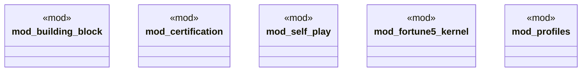

# `crates/ggen-architecture/src/canonical.rs`

Source SHA-256: `662806fff2f08c7569d3be57ec15e0cf4a529cc794c2fdddd7d510cd075c872f`

## Dependencies

- `building_block::{ ArchitectureFacet, Authority, BuildingBlock, BuildingBlockContract, BuildingBlockId, BuildingBlockRegistry, BuildingBlockViolation, CompositionReceipt, EvidenceKind, EvidenceObligation, EvidenceReceipt, LifecycleState, ObligationId, Port, PortDirection, PortId, PortKind, ProfileId, RealizationBinding, RealizationId, ResourceCeiling, ResourceClaim, Standing, SubstitutionAssessment, }`
- `certification::{ generate_rebuild_roadmap, seven_day_standards_profile, simulate_tai_rebuild, tai_case_study, testing_bblock_protocol, CertificationAward, CertificationLevel, CertificationProgram, CertificationRefusal, CertificationRequirement, CertificationRequirementKind, EvidenceLedger, RebuildRoadmap, RequirementReceipt, RoadmapAction, RoadmapStep, StandardAuthority, StandardCheckpoint, StandardStatus, StandardsProfile, StandardsProfileRefusal, TaiCaseStudy, TaiCaseStudyRefusal, TaiRebuildReceipt, TargetArchitectureInstance, TestingBblockProtocol, TestingBblockRefusal, TestingBblockStanding, TestingSuite, TestingSuiteKind, TestingSuiteStatus, CERTIFICATION_AWARD_SCHEMA, GBB_CERTIFICATION_PROGRAM_ID, GGEN_SEVEN_DAY_STANDARDS_ID, GGEN_SEVEN_DAY_STANDARDS_VERSION, REBUILD_ROADMAP_SCHEMA, TAI_CASE_STUDY_BROKER, TAI_CASE_STUDY_EXAMPLE, TAI_CASE_STUDY_ID, TAI_CASE_STUDY_PACK, TAI_CASE_STUDY_VERSION, TAI_REBUILD_RECEIPT_SCHEMA, TESTING_BBLOCK_PROTOCOL_ID, TESTING_BBLOCK_PROTOCOL_VERSION, }`
- `crate::fortune5_kernel as fortune5`
- `self_play::{ run_scenario, run_suite, verify_report, verify_suite, ActionSpec, ActorPolicy, ActorRole, Comparison, GameState, ManifestAction, ManifestActionAuthority, ManifestActionEvidence, ManifestEffect, ManifestGuard, ManifestMetricValue, ManifestPolicy, ManifestPolicyAuthority, ManifestPolicyWeight, ManifestScenario, ManifestScenarioConstraint, ManifestScenarioUseCase, Metric, MetricConstraint, MetricEffect, MoveReceipt, SelfPlayManifest, SelfPlayReport, SelfPlayScenario, SelfPlayStanding, SelfPlayViolation, UseCaseKind, SELF_PLAY_RECEIPT_SCHEMA, SELF_PLAY_REPORT_SCHEMA, SELF_PLAY_REQUIRED_BROKER, }`

## Standing

- Structural parse: `ALIVE`
- Runtime behavior: `UNKNOWN`
