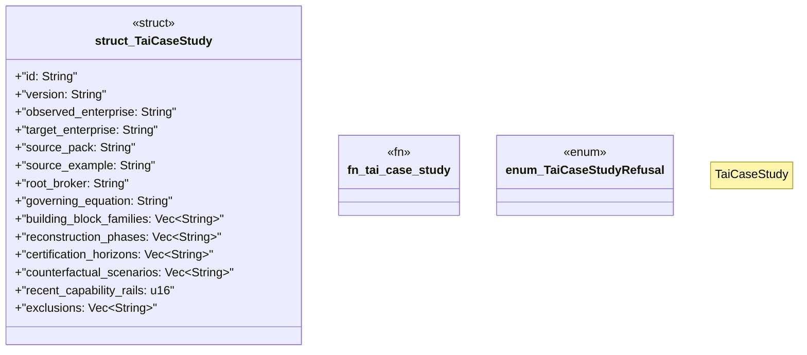

# `crates/ggen-architecture/src/certification/case_study.rs`

Source SHA-256: `0c9e4d8fbd7c1664d5ab50af8b197778c4d883d9a02958a691f1daf312ecff0b`

## Dependencies

- `serde::{Deserialize, Serialize}`
- `thiserror::Error`

## Standing

- Structural parse: `ALIVE`
- Runtime behavior: `UNKNOWN`
