# `crates/ggen-architecture/src/certification/mod.rs`

Source SHA-256: `481d1ab2cbef6e55239acd9853156e701d2f35b7c95d9b3420876fc2a588b38e`

```mermaid
classDiagram
    class mod_case_study {
      <<mod>>
    }
    class mod_program {
      <<mod>>
    }
    class mod_roadmap {
      <<mod>>
    }
    class mod_standards {
      <<mod>>
    }
    class mod_testing {
      <<mod>>
    }
    class enum_CertificationLevel {
      <<enum>>
    }
    class enum_CertificationRequirementKind {
      <<enum>>
    }
    class struct_CertificationRequirement {
      <<struct>>
      +"id: String"
      +"level: CertificationLevel"
      +"kind: CertificationRequirementKind"
      +"outcome: String"
      +"falsifier: String"
      +"artifact_schema: String"
    }
    class struct_RequirementReceipt {
      <<struct>>
      +"requirement_id: String"
      +"candidate_id: String"
      +"case_study_id: String"
      +"standards_profile_id: String"
      +"standards_profile_digest: String"
      +"positive_witness_digest: String"
      +"negative_falsifier_digest: String"
      +"independent_verifier_digest: String"
      +"receipt_verifier_digest: String"
      +"replay_digest: String"
      +"artifact_digest: String"
    }
    class struct_CertificationAward {
      <<struct>>
      +"schema: String"
      +"program_id: String"
      +"program_version: String"
      +"case_study_id: String"
      +"standards_profile_id: String"
      +"standards_profile_digest: String"
      +"candidate_id: String"
      +"level: CertificationLevel"
      +"requirement_ids: Vec~String~"
      +"receipt_digests: BTreeMap~String"
      +"digest: String"
    }
    class struct_TargetArchitectureInstance {
      <<struct>>
      +"id: String"
      +"case_study_id: String"
      +"standards_profile_id: String"
      +"standards_profile_digest: String"
      +"roots: BTreeSet~BuildingBlockId~"
      +"required_profiles: BTreeSet~ProfileId~"
      +"expected_composition_digest: Option~String~"
    }
    class enum_RoadmapAction {
      <<enum>>
    }
    class struct_RoadmapStep {
      <<struct>>
      +"sequence: u32"
      +"block_id: BuildingBlockId"
      +"action: RoadmapAction"
      +"rationale: String"
    }
    class struct_RebuildRoadmap {
      <<struct>>
      +"schema: String"
      +"target_id: String"
      +"case_study_id: String"
      +"standards_profile_id: String"
      +"standards_profile_digest: String"
      +"composition: CompositionReceipt"
      +"steps: Vec~RoadmapStep~"
      +"digest: String"
    }
    class struct_TaiRebuildReceipt {
      <<struct>>
      +"schema: String"
      +"candidate_id: String"
      +"target_id: String"
      +"case_study_id: String"
      +"standards_profile_id: String"
      +"standards_profile_digest: String"
      +"composition_digest: String"
      +"order: Vec~BuildingBlockId~"
      +"profiles: BTreeSet~ProfileId~"
      +"evidence_digests: BTreeMap~BuildingBlockId"
      +"standing: Standing"
      +"digest: String"
    }
    class enum_CertificationRefusal {
      <<enum>>
    }
    class fn_digest {
      <<fn>>
    }
    class type_EvidenceLedger {
      <<type>>
    }
    class mod_tests {
      <<mod>>
    }
    note "CertificationLevel"
```

## Dependencies

- `case_study::{ tai_case_study, TaiCaseStudy, TaiCaseStudyRefusal, TAI_CASE_STUDY_BROKER, TAI_CASE_STUDY_EXAMPLE, TAI_CASE_STUDY_ID, TAI_CASE_STUDY_PACK, TAI_CASE_STUDY_VERSION, }`
- `crate::building_block::{ BuildingBlockId, BuildingBlockRefusal, CompositionReceipt, EvidenceReceipt, LifecycleState, ProfileId, Standing, }`
- `program::CertificationProgram`
- `roadmap::{generate_rebuild_roadmap, simulate_tai_rebuild}`
- `serde::{Deserialize, Serialize}`
- `standards::{ seven_day_standards_profile, StandardAuthority, StandardCheckpoint, StandardStatus, StandardsProfile, StandardsProfileRefusal, GGEN_SEVEN_DAY_STANDARDS_ID, GGEN_SEVEN_DAY_STANDARDS_VERSION, }`
- `std::collections::{BTreeMap, BTreeSet}`
- `testing::{ testing_bblock_protocol, TestingBblockProtocol, TestingBblockRefusal, TestingBblockStanding, TestingSuite, TestingSuiteKind, TestingSuiteStatus, TESTING_BBLOCK_PROTOCOL_ID, TESTING_BBLOCK_PROTOCOL_VERSION, }`
- `thiserror::Error`

## Standing

- Structural parse: `ALIVE`
- Runtime behavior: `UNKNOWN`
