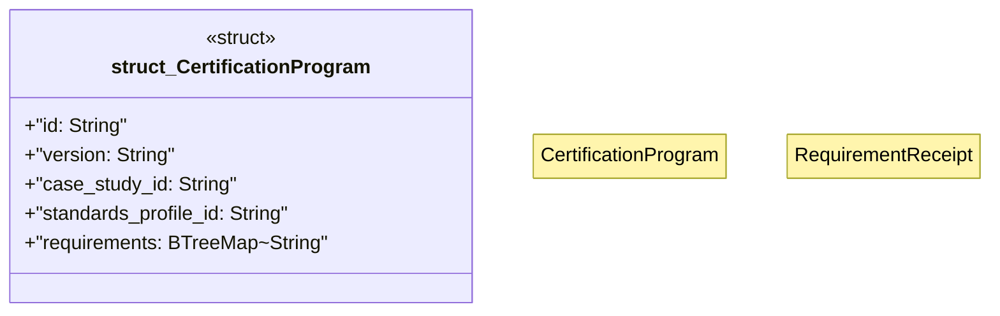

# `crates/ggen-architecture/src/certification/program.rs`

Source SHA-256: `ebce194bd72fc73ccf3b752e9d7084a9321c0f7eb0a6d536caaada158535b4ae`

## Dependencies

- `serde::{Deserialize, Serialize}`
- `std::collections::BTreeMap`
- `super::{ digest, seven_day_standards_profile, CertificationAward, CertificationLevel, CertificationRefusal, CertificationRequirement, CertificationRequirementKind, RequirementReceipt, CERTIFICATION_AWARD_SCHEMA, GBB_CERTIFICATION_PROGRAM_ID, GGEN_SEVEN_DAY_STANDARDS_ID, REBUILD_ROADMAP_SCHEMA, TAI_CASE_STUDY_ID, TAI_CASE_STUDY_VERSION, TAI_REBUILD_RECEIPT_SCHEMA, }`

## Standing

- Structural parse: `ALIVE`
- Runtime behavior: `UNKNOWN`
