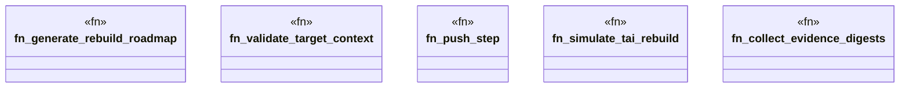

# `crates/ggen-architecture/src/certification/roadmap.rs`

Source SHA-256: `806604b035212730b09cb8e4a630fe25eaeb6a3e0624c4ef305fd36a349a1b42`

## Dependencies

- `crate::building_block::{ BuildingBlockId, BuildingBlockRegistry, CompositionReceipt, EvidenceReceipt, LifecycleState, ProfileId, Standing, }`
- `serde::Serialize`
- `std::collections::{BTreeMap, BTreeSet}`
- `super::{ digest, seven_day_standards_profile, CertificationRefusal, EvidenceLedger, RebuildRoadmap, RoadmapAction, RoadmapStep, TaiRebuildReceipt, TargetArchitectureInstance, REBUILD_ROADMAP_SCHEMA, TAI_CASE_STUDY_ID, TAI_REBUILD_RECEIPT_SCHEMA, }`

## Standing

- Structural parse: `ALIVE`
- Runtime behavior: `UNKNOWN`
