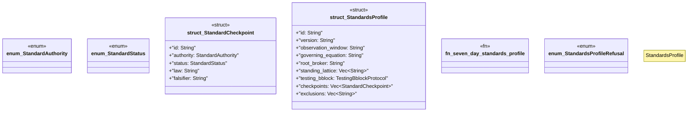

# `crates/ggen-architecture/src/certification/standards.rs`

Source SHA-256: `4ff2815a1d97367076d1ccac35122f6f5aff7312fb37b302a3410465590bc5e0`

## Dependencies

- `serde::{Deserialize, Serialize}`
- `std::collections::BTreeSet`
- `super::{digest, testing_bblock_protocol, TestingBblockProtocol, TestingBblockRefusal}`
- `thiserror::Error`

## Standing

- Structural parse: `ALIVE`
- Runtime behavior: `UNKNOWN`
