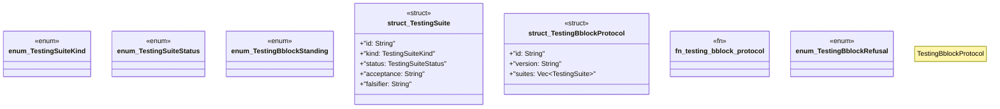

# `crates/ggen-architecture/src/certification/testing.rs`

Source SHA-256: `ed46f9fa6fb03ef10f02c97cab0b43cd737e7e9f97b02b14bf58fdc53282f730`

## Dependencies

- `serde::{Deserialize, Serialize}`
- `std::collections::BTreeSet`
- `thiserror::Error`

## Standing

- Structural parse: `ALIVE`
- Runtime behavior: `UNKNOWN`
