# `crates/ggen-architecture/src/certification/tests.rs`

Source SHA-256: `49228ef273cd6e73f301c998aa5d323f2e5df7d21de52c7d4c7b8e74076f29a7`

```mermaid
classDiagram
    class fn_standards_digest {
      <<fn>>
    }
    class fn_block {
      <<fn>>
    }
    class fn_evidence {
      <<fn>>
    }
    class fn_requirement_receipt {
      <<fn>>
    }
    class fn_complete_registry {
      <<fn>>
    }
    class fn_target {
      <<fn>>
    }
    class fn_tai_case_study_preserves_source_and_exact_cardinality {
      <<fn>>
    }
    class fn_seven_day_standards_are_exact_and_pending_work_cannot_promote {
      <<fn>>
    }
    class fn_standards_digest_changes_when_law_changes {
      <<fn>>
    }
    class fn_programme_has_five_levels_twelve_requirements_and_sixty_surfaces {
      <<fn>>
    }
    class fn_award_binds_candidate_case_and_exact_standards_profile {
      <<fn>>
    }
    class fn_award_refuses_missing_replay_detached_case_and_stale_standards {
      <<fn>>
    }
    class fn_gbb_state_generates_dependency_ordered_tai_roadmap {
      <<fn>>
    }
    class fn_complete_tai_rebuild_is_alive_and_replay_stable {
      <<fn>>
    }
    class fn_detached_target_stale_standards_and_terminal_lifecycle_are_refused {
      <<fn>>
    }
```

## Dependencies

- `crate::building_block::{ ArchitectureFacet, Authority, BuildingBlock, BuildingBlockContract, BuildingBlockId, BuildingBlockRegistry, EvidenceKind, EvidenceObligation, EvidenceReceipt, LifecycleState, ObligationId, Port, PortDirection, PortId, PortKind, ProfileId, RealizationBinding, RealizationId, ResourceCeiling, ResourceClaim, Standing, }`
- `std::collections::{BTreeMap, BTreeSet}`
- `super::*`

## Standing

- Structural parse: `ALIVE`
- Runtime behavior: `UNKNOWN`
