# `crates/ggen-architecture/src/lib.rs`

Source SHA-256: `1cccf89cfe985b736b64cfa0993a48e77ae7a989098019b0c7b8d950697c7374`

```mermaid
classDiagram
    class type_AssetId {
      <<type>>
    }
    class type_CapabilityId {
      <<type>>
    }
    class type_RegionId {
      <<type>>
    }
    class enum_Criticality {
      <<enum>>
    }
    class enum_AssetKind {
      <<enum>>
    }
    class enum_LifecycleState {
      <<enum>>
    }
    class struct_ArchitectureAsset {
      <<struct>>
      +"id: AssetId"
      +"name: String"
      +"kind: AssetKind"
      +"lifecycle: LifecycleState"
      +"owner: String"
      +"criticality: Criticality"
      +"dependencies: BTreeSet~AssetId~"
      +"capabilities: BTreeSet~CapabilityId~"
      +"regions: BTreeSet~RegionId~"
      +"evidence: BTreeSet~String~"
      +"tags: BTreeMap~String"
    }
    class struct_EnterpriseCapability {
      <<struct>>
      +"id: CapabilityId"
      +"name: String"
      +"owner: String"
      +"lifecycle: LifecycleState"
      +"realized_by: BTreeSet~AssetId~"
    }
    class struct_Region {
      <<struct>>
      +"id: RegionId"
      +"provider: String"
      +"jurisdiction: String"
      +"fault_domain: String"
      +"active: bool"
    }
    class enum_ReplicationMode {
      <<enum>>
    }
    class struct_ReplicationPolicy {
      <<struct>>
      +"asset_id: AssetId"
      +"mode: ReplicationMode"
      +"regions: BTreeSet~RegionId~"
      +"write_quorum: u16"
      +"read_quorum: u16"
      +"rpo_seconds: u64"
      +"rto_seconds: u64"
      +"allowed_jurisdictions: BTreeSet~String~"
    }
    class enum_SliKind {
      <<enum>>
    }
    class enum_ObjectiveDirection {
      <<enum>>
    }
    class struct_SloDefinition {
      <<struct>>
      +"id: String"
      +"asset_id: AssetId"
      +"sli: SliKind"
      +"direction: ObjectiveDirection"
      +"target: f64"
      +"window_seconds: u64"
      +"minimum_samples: u64"
      +"fast_burn_threshold: f64"
    }
    class struct_SliMeasurement {
      <<struct>>
      +"slo_id: String"
      +"observed: f64"
      +"samples: u64"
    }
    class enum_SloStanding {
      <<enum>>
    }
    class struct_SloEvaluation {
      <<struct>>
      +"slo_id: String"
      +"asset_id: AssetId"
      +"standing: SloStanding"
      +"observed: Option~f64~"
      +"target: f64"
      +"error_budget_delta: Option~f64~"
    }
    class struct_CapacityEnvelope {
      <<struct>>
      +"asset_id: AssetId"
      +"min_replicas: u32"
      +"max_replicas: u32"
      +"current_replicas: u32"
      +"unit_capacity: f64"
      +"observed_load: f64"
      +"reserve_ratio: f64"
    }
    class enum_CapacityStanding {
      <<enum>>
    }
    class struct_IdentityPolicy {
      <<struct>>
      +"asset_id: AssetId"
      +"trust_domain: String"
      +"allowed_spiffe_ids: BTreeSet~String~"
      +"mtls_required: bool"
      +"max_svid_ttl_seconds: u64"
      +"workload_attestation_required: bool"
    }
    class enum_KmsProvider {
      <<enum>>
    }
    class struct_KmsPolicy {
      <<struct>>
      +"asset_id: AssetId"
      +"provider: KmsProvider"
      +"key_alias: String"
      +"rotation_days: u32"
      +"hsm_backed: bool"
      +"envelope_encryption: bool"
      +"decrypt_audit_required: bool"
      +"break_glass_dual_control: bool"
    }
    class struct_ObservabilityPolicy {
      <<struct>>
      +"asset_id: AssetId"
      +"logs: bool"
      +"metrics: bool"
      +"traces: bool"
      +"profiles: bool"
      +"correlation_ids: bool"
      +"redaction_required: bool"
      +"retention_days: u32"
      +"otlp_endpoint_class: String"
    }
    class struct_PromotionGate {
      <<struct>>
      +"id: String"
      +"asset_id: AssetId"
      +"from: LifecycleState"
      +"to: LifecycleState"
      +"required_evidence: BTreeSet~String~"
      +"minimum_approvals: u16"
      +"require_slo_green: bool"
      +"require_receipt_replay: bool"
      +"require_security_controls: bool"
    }
    class struct_PromotionContext {
      <<struct>>
      +"available_evidence: BTreeSet~String~"
      +"approvals: u16"
      +"receipt_replay_green: bool"
      +"security_controls_green: bool"
    }
    class struct_PromotionDecision {
      <<struct>>
      +"gate_id: String"
      +"asset_id: AssetId"
      +"allowed: bool"
      +"reasons: Vec~String~"
    }
    class enum_ExecutionPath {
      <<enum>>
    }
    class struct_PathDecision {
      <<struct>>
      +"path: ExecutionPath"
      +"triples: u64"
      +"joins: u32"
      +"simple_predicates: bool"
      +"reason: String"
    }
    class fn_select_execution_path {
      <<fn>>
    }
    class struct_EnterpriseObservation {
      <<struct>>
      +"measurements: BTreeMap~String"
      +"unavailable_regions: BTreeSet~RegionId~"
      +"key_age_days: BTreeMap~AssetId"
      +"svid_ttl_remaining_seconds: BTreeMap~AssetId"
      +"telemetry_stale_assets: BTreeSet~AssetId~"
    }
    class enum_IntentPriority {
      <<enum>>
    }
    class enum_ArchitectureIntentKind {
      <<enum>>
    }
    class struct_ArchitectureIntent {
      <<struct>>
      +"schema: String"
      +"intent_id: String"
      +"source_asset: AssetId"
      +"kind: ArchitectureIntentKind"
      +"priority: IntentPriority"
      +"broker: String"
      +"reason: String"
      +"constraints: BTreeMap~String"
      +"evidence: BTreeSet~String~"
    }
    class struct_ImpactReport {
      <<struct>>
      +"changed_assets: BTreeSet~AssetId~"
      +"directly_affected: BTreeSet~AssetId~"
      +"transitively_affected: BTreeSet~AssetId~"
      +"affected_capabilities: BTreeSet~CapabilityId~"
      +"affected_regions: BTreeSet~RegionId~"
    }
    class struct_ArchitectureModel {
      <<struct>>
      +"assets: BTreeMap~AssetId"
      +"capabilities: BTreeMap~CapabilityId"
      +"regions: BTreeMap~RegionId"
      +"slos: BTreeMap~String"
      +"capacities: BTreeMap~AssetId"
      +"replication: BTreeMap~AssetId"
      +"identities: BTreeMap~AssetId"
      +"kms: BTreeMap~AssetId"
      +"observability: BTreeMap~AssetId"
      +"promotion_gates: BTreeMap~String"
    }
    class struct_Violation {
      <<struct>>
      +"code: String"
      +"subject: String"
      +"message: String"
    }
    class struct_ReceiptEnvelope {
      <<struct>>
      +"schema: String"
      +"operation: String"
      +"subject: String"
      +"revision: String"
      +"input_digest: String"
      +"output_digest: String"
      +"previous_digest: String"
      +"digest_algorithm: String"
      +"digest: String"
    }
    class struct_ReceiptLedger {
      <<struct>>
      +"receipts: Vec~ReceiptEnvelope~"
    }
    class fn_canonical_digest {
      <<fn>>
    }
    class fn_canonicalize {
      <<fn>>
    }
    class enum_KernelError {
      <<enum>>
    }
    class mod_tests {
      <<mod>>
    }
    note "ArchitectureIntent"
    note "ArchitectureModel"
    note "CapacityEnvelope"
    note "Criticality"
    note "LifecycleState"
    note "ReceiptEnvelope"
    note "ReceiptLedger"
    note "Violation"
```

## Dependencies

- `serde::{Deserialize, Serialize}`
- `serde_json::Value`
- `std::collections::{BTreeMap, BTreeSet, VecDeque}`
- `super::*`
- `thiserror::Error`

## Standing

- Structural parse: `ALIVE`
- Runtime behavior: `UNKNOWN`
