# `crates/ggen-architecture/src/self_play.rs`

Source SHA-256: `3d098bf30a98e469f1692fd805ab1570bbf7048d9721f7d51501d14f5963d2b3`

```mermaid
classDiagram
    class enum_UseCaseKind {
      <<enum>>
    }
    class enum_ActorRole {
      <<enum>>
    }
    class enum_Metric {
      <<enum>>
    }
    class enum_Comparison {
      <<enum>>
    }
    class struct_MetricConstraint {
      <<struct>>
      +"metric: Metric"
      +"comparison: Comparison"
      +"threshold: i64"
    }
    class struct_MetricEffect {
      <<struct>>
      +"metric: Metric"
      +"delta: i64"
    }
    class struct_ActorPolicy {
      <<struct>>
      +"actor: ActorRole"
      +"weights: BTreeMap~Metric"
      +"authorities: BTreeSet~String~"
      +"minimum_utility: i64"
    }
    class struct_ActionSpec {
      <<struct>>
      +"id: String"
      +"actor: ActorRole"
      +"choice_group: Option~String~"
      +"guards: Vec~MetricConstraint~"
      +"effects: Vec~MetricEffect~"
      +"required_authorities: BTreeSet~String~"
      +"evidence: BTreeSet~String~"
      +"broker_intent: bool"
    }
    class struct_SelfPlayScenario {
      <<struct>>
      +"id: String"
      +"use_cases: BTreeSet~UseCaseKind~"
      +"max_rounds: u32"
      +"initial_metrics: BTreeMap~Metric"
      +"policies: Vec~ActorPolicy~"
      +"actions: Vec~ActionSpec~"
      +"invariants: Vec~MetricConstraint~"
      +"goals: Vec~MetricConstraint~"
    }
    class struct_SelfPlayManifest {
      <<struct>>
      +"program_id: String"
      +"scenarios: Vec~ManifestScenario~"
      +"scenario_use_cases: Vec~ManifestScenarioUseCase~"
      +"initial_metrics: Vec~ManifestMetricValue~"
      +"policies: Vec~ManifestPolicy~"
      +"policy_weights: Vec~ManifestPolicyWeight~"
      +"policy_authorities: Vec~ManifestPolicyAuthority~"
      +"actions: Vec~ManifestAction~"
      +"guards: Vec~ManifestGuard~"
      +"effects: Vec~ManifestEffect~"
      +"action_authorities: Vec~ManifestActionAuthority~"
      +"action_evidence: Vec~ManifestActionEvidence~"
      +"invariants: Vec~ManifestScenarioConstraint~"
      +"goals: Vec~ManifestScenarioConstraint~"
    }
    class struct_ManifestScenario {
      <<struct>>
      +"id: String"
      +"max_rounds: u32"
    }
    class struct_ManifestScenarioUseCase {
      <<struct>>
      +"scenario_id: String"
      +"use_case: UseCaseKind"
    }
    class struct_ManifestMetricValue {
      <<struct>>
      +"scenario_id: String"
      +"metric: Metric"
      +"value: i64"
    }
    class struct_ManifestPolicy {
      <<struct>>
      +"scenario_id: String"
      +"actor: ActorRole"
      +"minimum_utility: i64"
    }
    class struct_ManifestPolicyWeight {
      <<struct>>
      +"scenario_id: String"
      +"actor: ActorRole"
      +"metric: Metric"
      +"weight: i64"
    }
    class struct_ManifestPolicyAuthority {
      <<struct>>
      +"scenario_id: String"
      +"actor: ActorRole"
      +"authority: String"
    }
    class struct_ManifestAction {
      <<struct>>
      +"scenario_id: String"
      +"id: String"
      +"actor: ActorRole"
      +"choice_group: Option~String~"
      +"broker_intent: bool"
    }
    class struct_ManifestGuard {
      <<struct>>
      +"scenario_id: String"
      +"action_id: String"
      +"metric: Metric"
      +"comparison: Comparison"
      +"threshold: i64"
    }
    class struct_ManifestEffect {
      <<struct>>
      +"scenario_id: String"
      +"action_id: String"
      +"metric: Metric"
      +"delta: i64"
    }
    class struct_ManifestActionAuthority {
      <<struct>>
      +"scenario_id: String"
      +"action_id: String"
      +"authority: String"
    }
    class struct_ManifestActionEvidence {
      <<struct>>
      +"scenario_id: String"
      +"action_id: String"
      +"evidence: String"
    }
    class struct_ManifestScenarioConstraint {
      <<struct>>
      +"scenario_id: String"
      +"metric: Metric"
      +"comparison: Comparison"
      +"threshold: i64"
    }
    class struct_GameState {
      <<struct>>
      +"round: u32"
      +"metrics: BTreeMap~Metric"
      +"executed_actions: BTreeSet~String~"
      +"chosen_groups: BTreeSet~String~"
    }
    class struct_MoveReceipt {
      <<struct>>
      +"schema: String"
      +"scenario_id: String"
      +"round: u32"
      +"actor: ActorRole"
      +"action_id: String"
      +"utility: i64"
      +"pre_state_hash: String"
      +"post_state_hash: String"
      +"predecessor: String"
      +"receipt_hash: String"
      +"evidence: BTreeSet~String~"
      +"broker_intent_emitted: bool"
      +"actuation_performed: bool"
    }
    class struct_SelfPlayReport {
      <<struct>>
      +"schema: String"
      +"scenario_id: String"
      +"use_cases: BTreeSet~UseCaseKind~"
      +"standing: SelfPlayStanding"
      +"fixed_point: bool"
      +"rounds: u32"
      +"final_state: GameState"
      +"receipts: Vec~MoveReceipt~"
      +"chain_head: String"
      +"replay_key: String"
      +"unmet_goals: Vec~String~"
      +"actuation_performed: bool"
    }
    class enum_SelfPlayStanding {
      <<enum>>
    }
    class enum_SelfPlayViolation {
      <<enum>>
    }
    class fn_run_scenario {
      <<fn>>
    }
    class fn_run_suite {
      <<fn>>
    }
    class fn_verify_report {
      <<fn>>
    }
    class fn_verify_suite {
      <<fn>>
    }
    class fn_validate_scenario {
      <<fn>>
    }
    class fn_select_move {
      <<fn>>
    }
    class fn_apply_action {
      <<fn>>
    }
    class fn_projected_metrics {
      <<fn>>
    }
    class fn_unmet_goals {
      <<fn>>
    }
    class fn_state_hash {
      <<fn>>
    }
    class fn_receipt_digest {
      <<fn>>
    }
    class fn_replay_key {
      <<fn>>
    }
    class fn_zero_hash {
      <<fn>>
    }
    class fn_require_identity {
      <<fn>>
    }
    class fn_scenario_mut {
      <<fn>>
    }
    class fn_policy_mut {
      <<fn>>
    }
    class fn_action_mut {
      <<fn>>
    }
    note "Comparison"
    note "MetricConstraint"
    note "SelfPlayManifest"
```

## Dependencies

- `serde::{Deserialize, Serialize}`
- `std::collections::{BTreeMap, BTreeSet}`
- `thiserror::Error`

## Standing

- Structural parse: `ALIVE`
- Runtime behavior: `UNKNOWN`
